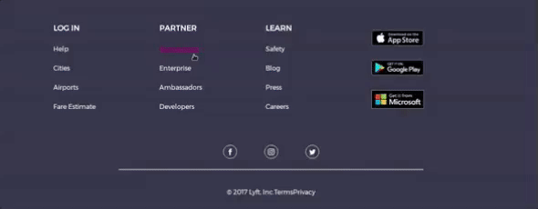

# Lyft

* **Track:** _Common Core_
* **Curso:** _Creando tu primer sitio web interactivo_
* **Unidad:** _Maquetado web con HTML & CSS_

***

## Objetivo

Replicar el sitio de **Lyft**

* Archivo base: `index.html` con
  estructura del proyecto y enlaces a archivo de estilo (CSS).

* En la carpeta `css` tendrás un archivo base `main.css` se encuentran los estilos necesarios del proyecto:

* Dentro de la carpeta `assets` se encuentra la carpeta `images` donde
  encontrarás todas las imágenes del proyecto

* Esta web utiliza la tipografía `Montserrat`.

* La paleta de colores puedes obtenerla inspeccionado el sitio original, pero
  para ganar tiempo, puedes usar los siguientes:

  - Botones, hover: `#FF00BF`
  - Fondo de `footer`: `#333447`
  - Título del formulario: `#352384`
  - Texto del formulario: `#728099`
  - Gradiente morado: `linear-gradient(#76278F, #2B1E66);`

* Para el footer, deberás tomar en cuenta que tiene un hover y se ve como en la
  siguiente imagen:

  

  Además, los íconos deberás obtenerlo de `Icomoon`.

* Para este reto, encontrarás ciertas cosas que probablemente aun no has visto
  en clase (formularios, videos de Youtube). No te preocupes, estamos seguros
  que los afrontarás con éxito, de igual forma aquí unos tips:

  - Estos son los videos de Youtube:
    * https://www.youtube.com/watch?v=fLSmUWOYpKw
    * https://www.youtube.com/watch?v=V7j8Aqxmbs8
    * https://www.youtube.com/watch?v=xj2VWLV0xCU
  - Para agregar los videos, averigua sobre la etiqueta `iframe`.
  - Para el formulario, revisa las etiquetas como `form` e `input`.

* Puedes ver el [sitio original](https://www.lyft.com/), sin embargo, su diseño
  ya ha cambiado en ciertas partes, así que tu fuente de verdad es la imagen que
  muestra el objetivo de este reto.

  > Nota: El sitio original tiene ciertos efectos y funcionalidades que
están fuera del alcance de este reto. Enfócate en obtener la maquetación
lo más parecido posible, usando lo aprendido en clase ;)

##READ ME HTML Lyft Project 

Definir, dentro de html, un head a contener: title, idioma y enlaces a utilizar para
fuentes, iconos y documento css.
Cerrar head. 
Abrir body.  
Dentro de body se inserta la seccion nav.
Dentro del nav se insertan dos div, uno con clase logo para insertar imagen y
el otro para la etiqueta ul con sus il para enlistar menu. 
Definir 3 secciones, la primera con: h2 para texto principal,
salto de linea,un bloque p para texto secundario, otro salto de linea,
input, salto de linea,boton y texto discreto.
Segunda seccion con div 1 para textos del area de beneficios con
      h2 y p y div 2 para imagen.
Tercera seccion para los videos y sus textos.
      Cada div, a su vez, cuenta con otro div y dentro detallamos los textos
      correspondientes a los clips con etiquetas de texto y elementos iframe.
			Los primeros 3 div contienen listas.
				Abrir primer div secundario.
				Abrir segundo div secundario.
			Cerrar segundo div secundario.
			Abrir tercer div secundario.
			Cerrar tercer div secundario.
			Cuarto div con imagenes de las tiendas de aplicaciones principales.
		  Cerrar cuarto div.
		  Cerramos div principal del footer.
		El quinto div fuera de div principal de footer contendrá redes sociales.
	  Cerrar 5to div.
		Insertar linea horizontal seguida de p con texto deseado.
		Cerrar footer.
	  Cerrar body.
    Cerrar html,
